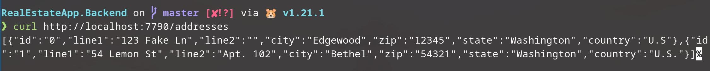
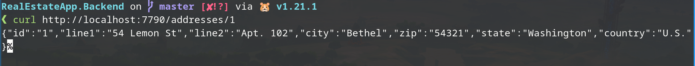
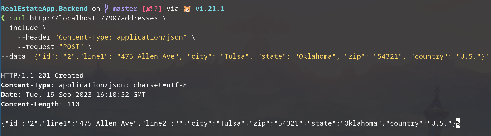
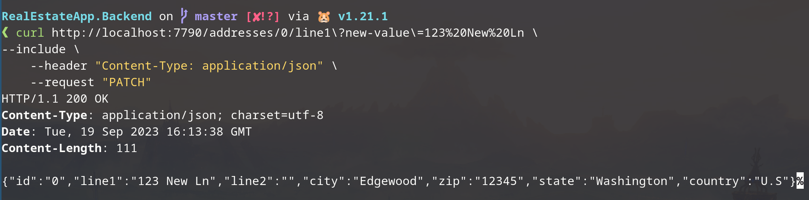
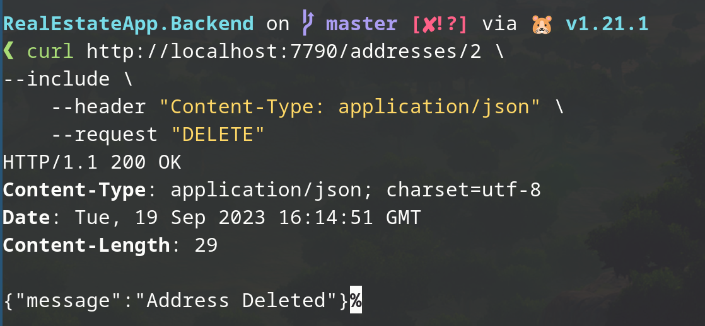

# Real Estate App Backend

A backend for a Real Estate posting app, basically a Zillow clone. The app is 
written in Go, pulls from a PostreSQL database and is deployed and hosted on 
Netlify. The endpoints are built using standard RESTful conventions.  

## Technology Stack

The following technologies have been selected to implement and/or manage
backend components:

| Component | Technology / Language | Description |
| :--- | :---: | :--- |
| Server | Netlify | Server hosting and deployment |
| Database | PostgreSQL | DBMS |
| API | Go | Language used to build the app. API endpoints are built using standard [Restful API conventions](https://medium.com/@nadinCodeHat/rest-api-naming-conventions-and-best-practices-1c4e781eb6a5) |

## Endpoint Screenshots

### GET

### GET by ID

### POST

### PATCH

### DELETE

## Project Progress

- [x] API functionality
    - [x] Go modules
    - [x] Gin framework router 
    - [x] Ability to send/receive HTTP requests/responses
    - [x] GET, GET by ID, POST, PATCH, and DELETE
- [ ] Unit testing
- [ ] PostgreSQL
    - [ ] Connection
    - [ ] Tables
        - [ ] Agent
        - [ ] User
        - [ ] Address
        - [ ] City
        - [ ] State
        - [ ] Country
        - [ ] Posting
- [ ] API implementation
    - [ ] Agent
    - [ ] User
    - [x] Address
    - [ ] Posting
- [ ] Netlify
    - [ ] Deployed
